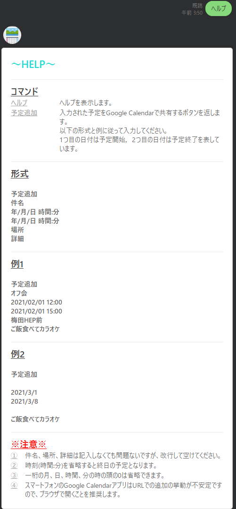
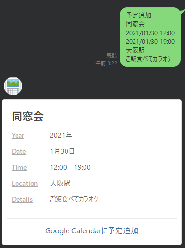
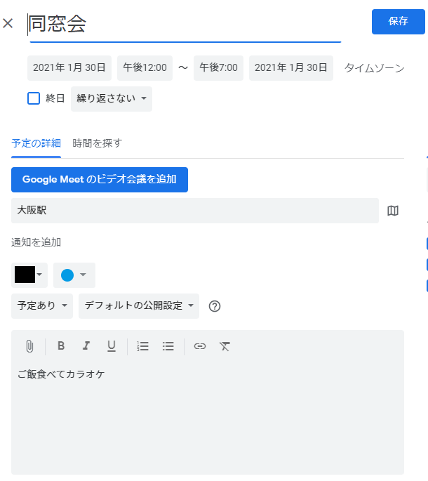
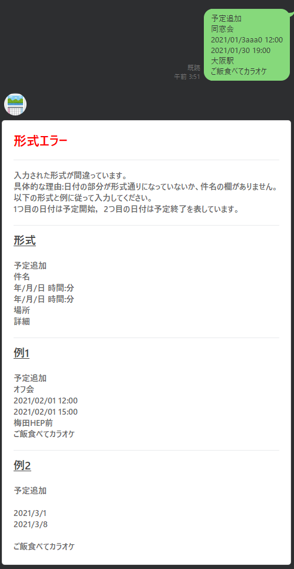

# 予定共有Bot
入力された予定をGoogle Calendarで共有するボタン付きメッセージを返すLine Botです。
herokuにデプロイしています。以下のQRコードから追加できます。

[予定共有Bot-QRコード](https://lin.ee/yJfSjFm)

## 使用した技術・API
- Java
- Spring boot
- Docker
- LINE Messaging API

## 開発の意図
今まではLINE上のグループで知人と話し合って予定を決めた時に，各々がカレンダーに予定を入力しなければなりません。

このLINE Botを使って1人が予定を入力すれば，他のメンバーはBotが返すボタン付きメッセージのボタンを押すだけでカレンダーに予定を追加できるようになるため，各々が予定を入力する手間を解消します。

## 使用方法・機能紹介

1. グループ参加時は以下のメッセージを返します。

2. 「ヘルプ」と打つとヘルプを表示します。

3. 形式に合わせて適当な予定を入力するとボタン付きメッセージを返します。

4. ボタンにはURLが埋め込まれており，押してブラウザに遷移するとGoogle Calendarの予定作成ページに飛びます。作成ページのパラメータには入力した予定の情報が反映されています。

5. 不正な予定(件名と日付の欄が足りていない，予定終了の日時はが開始の日時より前になっている，日付の欄に日付ではないものがある等)を入力すると，エラーメッセージを表示します。

