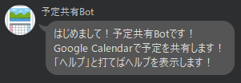

# 予定共有Bot
入力された予定をGoogle Calendarで共有するボタンを返すLine Botです。
herokuにデプロイしています。以下のQRコードから追加できます。

[予定共有Bot-QRコード](https://lin.ee/yJfSjFm)

## 使用した技術・API
- Java
- Spring boot
- Docker
- LINE Messaging API

## 使用方法・機能紹介

- グループ参加時は以下のメッセージを返します。

- 「ヘルプ」と打つとヘルプを表示します。

- 形式に合わせて適当な予定を入力するとボタン付きメッセージを返します。

- ボタンにはURLが埋め込まれており，押してブラウザに遷移するとGoogle Calendarの予定作成ページに飛びます。作成ページのパラメータには入力した予定の情報が反映されています。

- 不正な予定(件名と日付の欄が足りていない，予定終了の日時はが開始の日時より前になっている，日付の欄に日付ではないものがある等)を入力すると，エラーメッセージを表示します。

